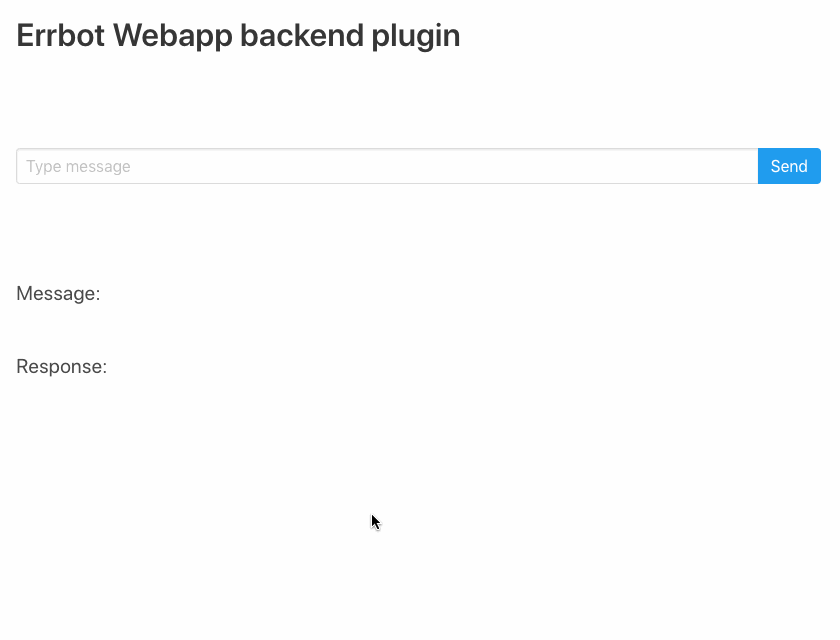

============================
Errbot Webapp backend plugin
============================

.. image:: https://travis-ci.com/attakei/errbot-backend-webapp.svg?branch=master
    :target: https://travis-ci.com/attakei/errbot-backend-webapp

**This is alpha-level implementation. Use only local**

Web UI based backend interface for Errbot (not Webhook feature).

Overview
========

This plugin can exchange messages Errbot and any browsers by WebSocket.
It may be able to supply public chat-bot on a website with Errbot.

Demo
====

Features
========

* Exchange messages by WebSocket
* HTML for reference implementtion

Usage
=====

Prerequirements
---------------

You must ready environment to run Errbot(>=6.0.x).

Installation
------------

As single source
^^^^^^^^^^^^^^^^

Clone this project and configure to use as extra-backend for Errbot.

.. code-block:: bash

   $ cd /path/to/your-errbot-env
   $ git clone https://github.com/attakei/errbot-backend-webapp.git
   $ echo "BOT_EXTRA_BACKEND_DIR = './errbot-backend-webapp'" >> ./config.py
   $ echo "BACKEND = 'Webapp'" >> ./config.py

As PyPI package
^^^^^^^^^^^^^^^

.. code-block:: bash

   $ cd /path/to/your-errbot-env
   $ pip install errbot-backend-webapp
   $ echo "import errbot_backend_webapp" >> ./config.py
   $ echo "BOT_EXTRA_BACKEND_DIR = errbot_backend_webapp.get_plugin_dir()" >> ./config.py
   $ echo "BACKEND = 'Webapp'" >> ./config.py

To Do
=====

- Configuration HOST, PORT and static resource dir
- 'As admin' mode
- Authorize by session

License
=======

GPLv3. `See it <./LICENSE>`_
